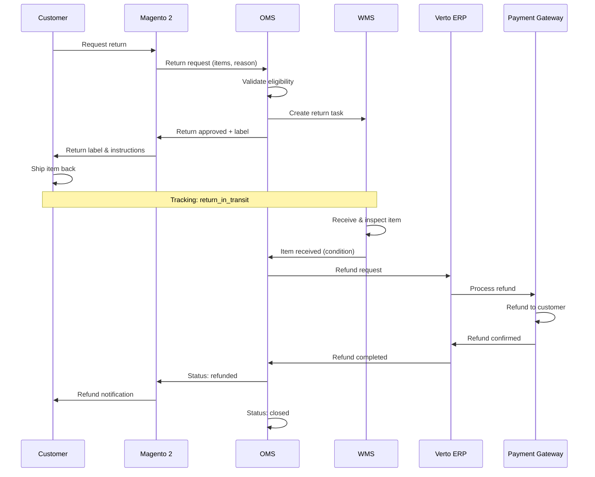
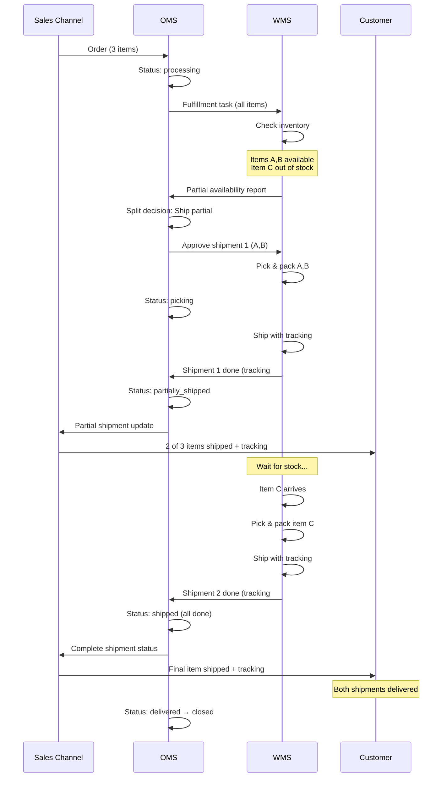

# Return Flow & Partial Shipment Scenarios

This document describes the complete return flow and partial shipment handling in the multichannel e-commerce architecture.

## Table of Contents

1. [Full Return Flow](#full-return-flow)
2. [Partial Shipment Flow](#partial-shipment-flow)
3. [Sequence Diagrams](#sequence-diagrams)
4. [Edge Cases](#edge-cases)

---

## Full Return Flow

### Overview

The return process allows customers to return purchased items through any sales channel. The OMS orchestrates the return across all systems.

### Step-by-Step Process

1. **Customer Initiates Return**
   - Customer requests return via Magento 2 storefront or Baselinker interface
   - Customer selects items to return and provides reason
   - Sales channel creates return request

2. **Return Request to OMS**
   - Sales channel (Magento 2 / Baselinker) sends return request to OMS
   - OMS validates return eligibility (return window, item condition, order status)
   - If approved, OMS updates order status to `return_requested`

3. **WMS Task Creation**
   - OMS creates return task in WMS
   - Return task includes: expected items, customer address, return label
   - WMS status: awaiting item

4. **Customer Ships Item**
   - Customer receives return label (email/portal)
   - Customer packages item and ships via courier
   - Tracking updates show `return_in_transit`
   - OMS updates order status based on tracking

5. **WMS Receives and Inspects**
   - WMS receives returned package
   - Warehouse staff inspects item condition
   - WMS records: item received, condition (new/used/damaged), disposition (restock/discard)
   - WMS → OMS: Item received, inspection results

6. **Refund Processing**
   - OMS validates inspection results
   - If approved, OMS creates refund request
   - OMS → Verto ERP: Refund request with order and payment details
   - Verto validates financial data

7. **Refund Execution**
   - Verto ERP initiates refund through Payment Gateway
   - Payment Gateway processes refund to customer's original payment method
   - Payment Gateway → Verto: Refund confirmation
   - Verto → OMS: Refund completed

8. **Status Updates**
   - OMS updates order status to `refunded`
   - OMS → Sales channels: Status update
   - Sales channel notifies customer (email, account page)
   - After confirmation, OMS sets status to `closed`

### Return Flow Sequence Diagram



---

## Partial Shipment Flow

### Overview

Partial shipments occur when an order cannot be fulfilled entirely at once. This is common when:
- Items are in different warehouse locations
- Some items are temporarily out of stock
- Large orders are split into multiple shipments
- High-value orders require signature confirmation per package

### Step-by-Step Process

1. **Order Received**
   - OMS receives order from sales channel
   - Order contains multiple items (e.g., 3 products, 2 units each)
   - OMS status: `processing`

2. **Fulfillment Task Created**
   - OMS → WMS: Fulfillment task with all items
   - OMS marks order as ready for fulfillment
   - OMS status: `processing`

3. **WMS Checks Inventory**
   - WMS checks real-time stock availability
   - Finds partial availability: 
     - Product A: 2 units (available)
     - Product B: 2 units (available)
     - Product C: 0 units (out of stock, expected in 3 days)

4. **OMS Split Decision**
   - WMS → OMS: Partial availability report
   - OMS applies split rules:
     - Ship available items now?
     - Wait for complete order?
     - Customer preference?
   - OMS decides: Split into 2 shipments

5. **First Shipment**
   - WMS picks available items (Products A & B)
   - WMS status: `picking`
   - OMS updates: `picking`
   - WMS packs and ships
   - WMS → OMS: Shipment 1 completed (tracking #1)
   - OMS status: `partially_shipped`

6. **Customer Notification**
   - OMS → Sales channel: Partial shipment update
   - Sales channel → Customer: 
     - "2 of 3 items shipped"
     - Tracking number for shipment 1
     - ETA for remaining items

7. **Stock Replenishment**
   - Product C arrives at warehouse
   - WMS updates inventory
   - WMS identifies pending partial order

8. **Second Shipment**
   - WMS picks Product C
   - WMS packs and ships
   - WMS → OMS: Shipment 2 completed (tracking #2)
   - OMS checks: All items shipped?
   - OMS status: `shipped` (all items fulfilled)

9. **Final Updates**
   - OMS → Sales channel: Complete shipment status
   - Sales channel → Customer: Final tracking number
   - When both delivered: OMS status: `delivered` → `closed`

### Partial Shipment Sequence Diagram



---

## Edge Cases

### 1. Return of Partially Shipped Order

**Scenario**: Customer receives first shipment and wants to return it before second shipment arrives.

**Handling**:
1. Customer initiates return for received items
2. OMS creates return task for received items only
3. Second shipment still proceeds (unless customer cancels entire order)
4. If entire order cancelled:
   - Return process for shipped items
   - Cancellation process for unshipped items
   - Partial refund issued after return inspection

### 2. Damaged Item in Partial Shipment

**Scenario**: First shipment arrives damaged; customer reports issue.

**Handling**:
1. Customer reports damage via sales channel
2. OMS creates damage claim
3. Options:
   - **Replace in second shipment** (if same item): Add replacement to second shipment
   - **Immediate replacement**: Ship separately with expedited shipping
   - **Refund damaged item**: Process partial refund, complete rest of order
4. OMS tracks both original order and damage claim separately

### 3. Second Shipment Never Ships (Long-term Backorder)

**Scenario**: Item C never comes back in stock after 30 days.

**Handling**:
1. OMS monitors backorder duration
2. After threshold (e.g., 30 days):
   - Auto-cancel remaining items
   - Partial refund issued
   - OMS status: `partially_shipped` → `closed`
3. Customer notification: "Backordered item cancelled, refund issued"

### 4. Return of Item from Second Shipment

**Scenario**: Customer keeps first shipment but returns item from second shipment.

**Handling**:
1. Normal return flow applies
2. OMS tracks which shipment the item came from
3. Partial refund based on returned item only
4. Order status progression:
   - `delivered` → `return_requested` → `return_received` → `partially_refunded` → `closed`

### 5. Full Return After Partial Shipment

**Scenario**: Customer returns everything after both shipments delivered.

**Handling**:
1. Customer initiates returns for all items
2. OMS creates multiple return tasks (one per shipment/item group)
3. Returns can arrive at different times
4. Refunds processed as items are inspected
5. Final refund issued when all returns inspected
6. Order status: `delivered` → `return_requested` → `return_received` → `refunded` → `closed`

---

## Business Rules

### Partial Shipment Rules

1. **Split Threshold**: Only split if delay > X days (e.g., 3 days)
2. **Customer Preference**: Honor customer choice (wait vs. split)
3. **Minimum Shipment Value**: Don't ship if remaining items < $Y
4. **Maximum Splits**: Limit to N shipments per order (e.g., 3)
5. **Shipping Costs**: First shipment: standard, subsequent: free

### Return Rules

1. **Return Window**: 30 days from delivery (per shipment for partial orders)
2. **Item Condition**: Must be unused with tags/packaging
3. **Non-returnable Items**: Hygiene products, custom items, sale items
4. **Refund Timeline**: 5-7 business days after inspection
5. **Return Shipping**: Customer pays unless item defective

### Refund Rules

1. **Refund Method**: Original payment method
2. **Partial Refunds**: Deduct return shipping if customer's fault
3. **Restocking Fee**: 15% if item opened/used (if allowed)
4. **Gift Cards**: Refund to gift card if paid with gift card
5. **Taxes**: Refund includes original taxes paid

---

## System Configuration

### OMS Configuration

```yaml
partial_shipment:
  enabled: true
  split_threshold_days: 3
  max_splits_per_order: 3
  min_shipment_value: 10.00
  customer_choice_required: false

returns:
  window_days: 30
  allow_partial_returns: true
  require_reason: true
  auto_approve: false
  restocking_fee_percent: 15

refunds:
  processing_time_days: 7
  deduct_return_shipping: true
  minimum_refund_amount: 1.00
```

### Status Mappings

| OMS Status | Magento 2 Display | Baselinker Status | Customer Message |
|------------|-------------------|-------------------|------------------|
| `partially_shipped` | "Partially Shipped" | "In Progress" | "Some items shipped" |
| `return_requested` | "Return Requested" | "Return" | "Return in progress" |
| `refunded` | "Refunded" | "Refunded" | "Refund completed" |

---

## Monitoring & Alerts

### Key Metrics

1. **Partial Shipment Rate**: % of orders split
2. **Return Rate**: % of orders with returns
3. **Return Processing Time**: Days from request to refund
4. **Partial Shipment Completion Time**: Days between shipments
5. **Customer Satisfaction**: Post-return survey scores

### Alerts

- Partial shipment rate > 20%
- Return rate > 10%
- Return processing time > 10 days
- Backorder duration > 30 days
- Refund failures

---

## See Also

- [Order Statuses](order-statuses.md) - Complete status definitions
- [ADR-001: OMS as Source of Truth](ADR-001-oms-source-of-truth.md) - Why OMS orchestrates
- [Order Lifecycle Diagram](order-lifecycle.mmd) - Visual flow
